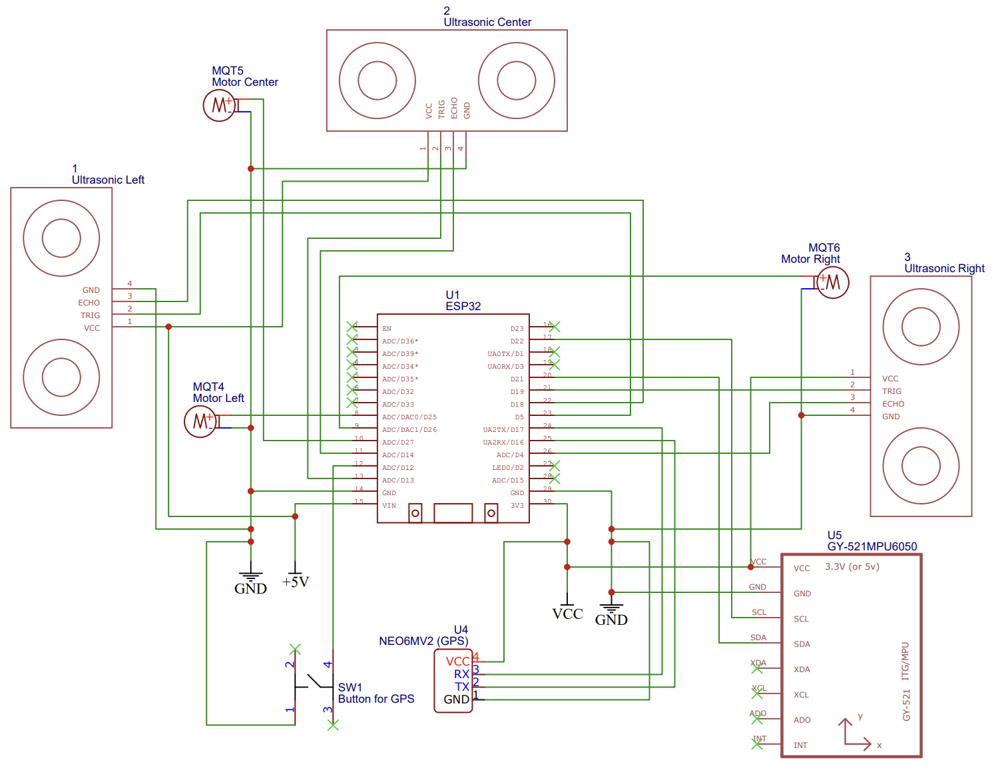
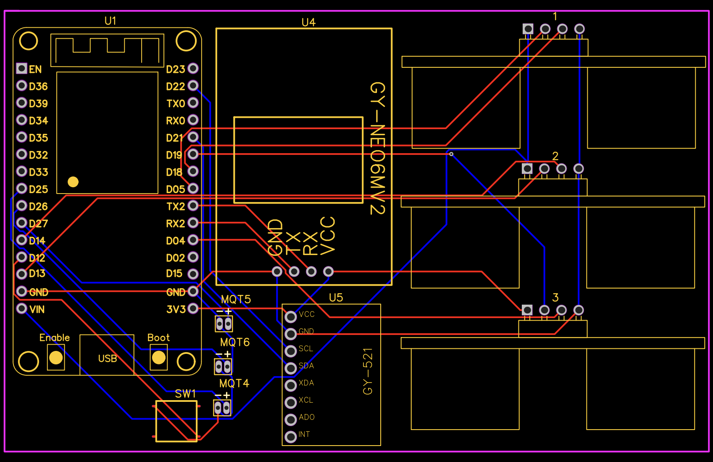

# Smart Belt: AIoT Assistive Wearable for the Visually Impaired

## Project Overview
**Smart Belt** is an integrated assistive wearable designed to enhance the mobility and safety of visually impaired individuals. The device combines **obstacle detection**, **fall detection**, and **real-time GPS tracking & SOS alerts** into a compact, ergonomic form factor.

**Key Achievements:**
* Achieved 100% success rate in fall detection trials using MPU6050 sensor fusion.
* Low-latency IoT communication (1 second) for emergency alerts via Telegram & Blynk.
* Engineered a custom PCB to minimize device footprint and improve signal integrity.

## System Architecture
The system is built around the ESP32 microcontroller, integrating multiple sensor inputs and actuator outputs:

* **Controller:** ESP32 DevKit V1 (Dual-core, Wi-Fi/Bluetooth)
* **Sensors:**
    * `MPU6050` (6-Axis IMU) for fall detection
    * `HC-SR04` (Ultrasonic) for obstacle detection
    * `GPS Module` (NEO-6M) for real-time location tracking
* **Actuators:** Vibration motors (haptic feedback)
* **Power:** Standard 5V USB power bank (portable)

## Hardware Design (PCB & Schematics)
We moved beyond breadboard prototypes to a **custom-designed PCB** (Printed Circuit Board) using **EasyEDA** to ensure durability and wearable comfort.

### 1. Schematic Diagram

*Figure 1: Complete circuit diagram showing connections between ESP32, sensors, and actuators.*

### 2. PCB Layout

*Figure 2: Custom PCB layout designed to fit within the enclosure.*

## Firmware Logic (State Machine)
The firmware implements a multitasking architecture:

1.  **Obstacle Avoidance:** Maps ultrasonic distance ($d$) to vibration intensity
2.  **Fall Detection Algorithm:**
    * Computes Sum Vector Magnitude (SVM): $SVM = \sqrt{a_x^2 + a_y^2 + a_z^2}$
    * Trigger: If $SVM > Threshold$ AND Orientation changes $\rightarrow$ Trigger SOS
3.  **IoT Connectivity:** Sends live GPS coordinates to Blynk and alerts family members via Telegram Bot

## Mechanical Design
The device enclosure was engineered using **Autodesk Fusion 360** to ensure an ergonomic fit for daily wear. The casing features a modular design to house the PCB, power bank, sensors, and motors securely.

* **Fabrication Method:** FDM 3D Printing (PLA Material)
* **Design Considerations:** Lightweight structure, snap-fit assembly, and ventilation for heat dissipation

## Documentation
The comprehensive technical report (in Indonesian) covers the detailed mechanical design process, circuit testing, and algorithm validation.

👉 **[Download Full Report (Bahasa Indonesia)](Smart_Belt_Report_Indonesian.pdf)**

---
*Developed by Crystaly, Shifwa Aqila, and Farhan Abdurrahman*
